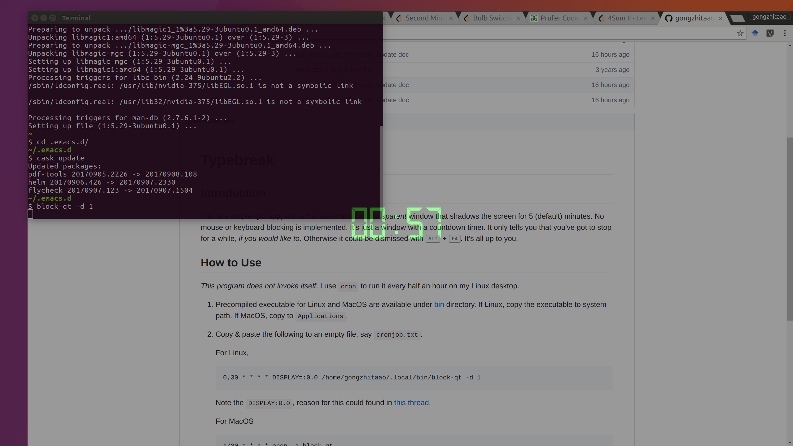

Typebreak
=========

## Introduction

This is a simple Qt5 app, with a *frameless* and *half transparent* window that
shadows the screen for 5 (default) minutes.  No mouse or keyboard blocking is
implemented.  It's just a window with a countdown timer.  It only tells you that
you've got to stop for a while, *if you would like to*.  Otherwise it could be
dismissed with <kbd>ALT</kbd> + <kbd>F4</kbd>.  It's all up to you.



## How to Use

*This program does not invoke itself*.  I use `cron` to run it every half an
hour on my Linux desktop.

1. Precompiled executable for Linux and MacOS are available under [bin](./bin)
   directory.  If Linux, copy the executable to system path.  If MacOS, copy to
   `Applications`.
2. Copy & paste the following to an empty file, say `cronjob.txt`.

   For Linux,

   ```text
   0,30 * * * * DISPLAY=:0.0 /home/gongzhitaao/.local/bin/block-qt -d 1
   ```

   Note the `DISPLAY:0.0`, reason for this could found in [this thread](http://unix.stackexchange.com/questions/154451/qt-program-not-invoked-by-cron).

   For MacOS

   ```text
   */30 * * * * open -a block-qt
   ```

   Note that `0,30` and `*/30` are equivalent.

3. In command line, type `contab cronjob.txt` to register this cron job.
   Basically it tells the system to run this program every half an hour.

## Command Line Usage

This app supports some simple command line arguments, type `block-qt -h` to see
the options.

```text
-d, --duration <x>  Shadows the screen for <x> minutes
-h, --help          Displays this help.
-v, --version       Displays version information.
```
